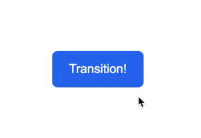

# Button Hover

გამოიყენეთ transition და დაადეთ scale ღილაკს, როდესაც მაუსის კურსორს მივიტანთ ღილაკთან.

## დასრულებული

### გადამოწმება

- იზრდება ღილაკი ზომაში როდესაც მასზე მივიტანთ მაუსს?
- ღილაკის სხვა სტილები ხომ არ შეგიცვლიათ?
- არის გამოყენებული `:hover` ფსეუდო-კლასი ტრანზიციისთვის?
