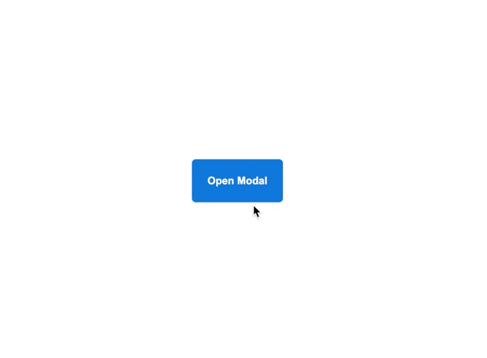

# Popup

ამ დავალებაში მოგიწევთ გაუკეთოთ pop-up ლამაზი ანიმაცია. ის უკვე ფუნქციონირებადია, გაუშვით index.html და დააჭირეთ ღილაკს.

ასევე მოყვება ჯავასკრიპტის კოდი, რომელიც ადებს და უშლის `.show` კლასს. თქვენი დავალებაა სურათში ნაჩვენები შედეგი მიიღოთ.

### მინიშნებები
- "modal" იგივეა რაც 'pop-up'
- კოდში, რომელიც მოყვება დავალებას, popup საბოლოო პოზიციაზე დგას. თქვენ უნდა შეცვალოთ საწყისი პოზიცია და გამოიყენოთ ტრანზიცია, რომლის დახმარებითაც ცენტრში დააბრუნებთ.
- საწყისი opacity-ს დაყენება მოგიწევთ 0%-ზე, ან 20%-ზე, ან როგორც საჭიროდ თვლით, რათა დაინახოთ საიდან იწყებს მოძრაობას სანამ ღილაკს დააწვებით.
- ზედმეტი არ იფიქროთ ამ დავალებაზე, შესაძლოა ჩახლართულად მოგეჩვენოთ, მაგრამ სინამდვილეში რამდენიმე ხაზი კოდის დაწერაა საჭირო.

## დასრულებული

### გადამოწმება

- pop-up ჩამოდის ზევიდან ქვევით ცენტრამდე და როდესაც "close modal"-ს აწვებით, ისევ ზევით ადის.
- opacity კარგი გადასვლით ქრება და ედება.
