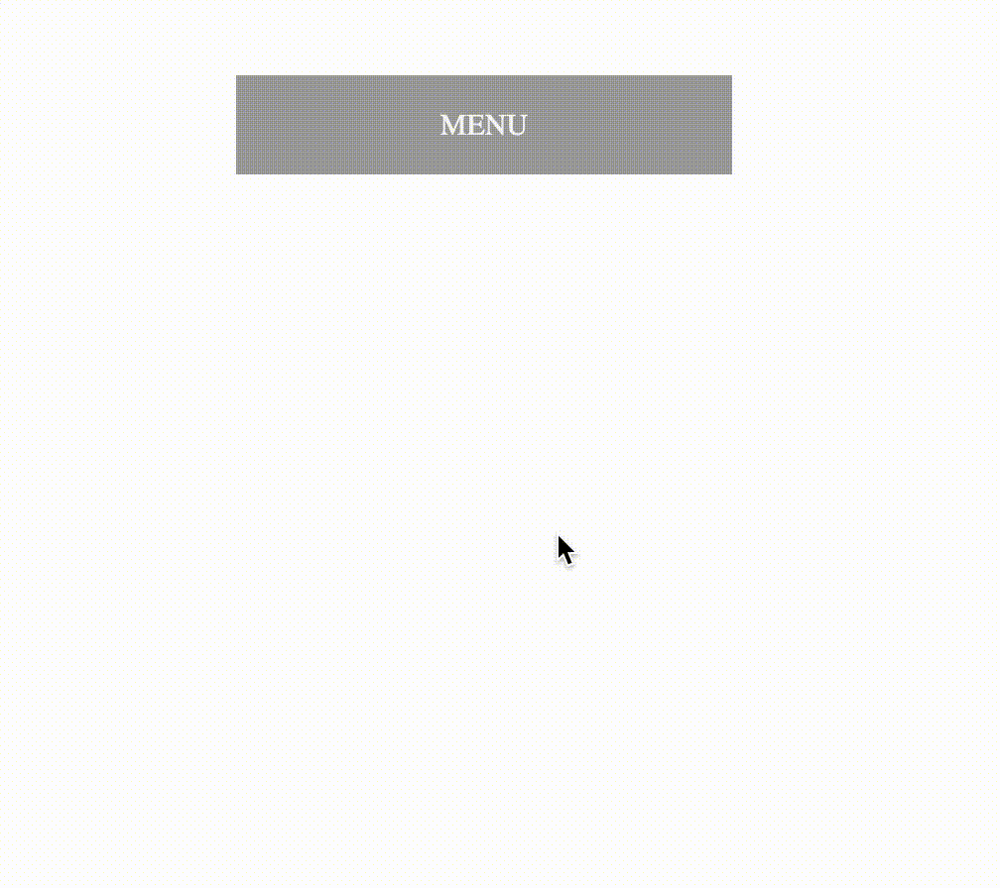

# ჩამოსაშლელი მენიუ

თქვენ მოგიწევთ ჩამოსაშლელი მენიუს გაკეთება ამ დავალებაში. გახსენით გვერდი და ნახავთ ერთ ღილაკს, რომელიც არის ჩამოსაშლელი მენიუ და მასზე დაჭერისას გაგიხსნით მთლიან მენიუს.

თქვენი დავალებაა დაამატოთ ანიმაცია ამ ჩამოსაშლელ მენიუს, რომელსაც ექნება გაზრდის ეფექტი. დააკვირდით gif-ს, ბოლომდე ზომასთან შედარებით უფრო იზრდება და მერე ისევ თავის ზომაზე დგება (bounce).

### მინიშნება
- უნდა დააზუსტოთ `transform-origin` სტილი სწორად, რათა ჩამოსაშლელმა მენიუმ ტრანსფორმაცია ზევიდან დაიწყოს.
- უნდა დაამატოთ კიდევ ერთი ნაბიჯი keyframe-ს, რათა მიიღოთ ეს "ბაუნსის" ილუზია.

## დასრულებული

### გადამოწმება

- ჩამოსაშლელი მენიუ იზრდება დაკლიკებისას.
- აქვს ბაუნსის ილუზია.