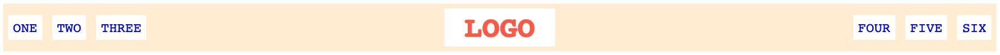

# უბრალო ჰედერი

გამოიყენეთ ფლექსბოქსის წესები, რათა გააკეთოთ ჩვეულებრივი ჰედერი. ფლექსის აქ გამოყენების უპირატესობა ისაა, რომ ყველაფერი იქნება მოქნილი. შეხედეთ ქვემოთ მოცემულ სქრინშოთებს და მიხვდებით ეკრანის ზომასთან მიმართებით როგორი მოქნილია. ფლექსის წესებისგან განსხვავებით თქვენ ასევე მოგიწევთ მარჯინისა და პადინგის დამატება (`ul`-ს აქვს ბრაუზერის მიერ გაწერილი მარჯინი/პადინგი, რომელსაც უნდა გაუმკლავდეთ.)

## დასრულებული

ვიწრო:

განიერი: 

### გადამოწმება

- არის სივრცე აითემებს შორის და ჰედერის გვერდებზეც (სპეციფიურ პიქსელების რაოდენობას მნიშვნელობა არ აქვს.)
- ლოგო არის ცენტრში ვერტიკალურად და ჰორიზონტალურად.
- სიის აითემები არის ჰორიზონტალური და არის ცენტრში ვერტიკალურად ჰედერში.
- მარცხენა ლინკები და მარჯვენა ლინკები უკიდურეს მარცხენა და მარჯვენა ნაწილშია, რათა დარჩეს კუთხეში როცა გვერდს ზომას შევუცვლით.
- თქვენი ამოხსნა არ იყენებს float-ს, inline-block-ს ან absolute პოზიციას.