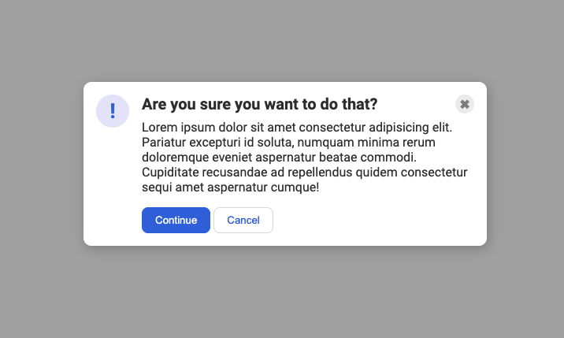

# მოდალი

კიდევ ერთი ხშირი რამ, რაც შეგხვდებათ ვებგვერდებზე არის მოდალი. ამის გაკეთება არის მარტივი, მაგრამ შეიძლება პირდაპირ ვერ მიხვდეთ. ასევე დაგჭირდებათ HTML-ს შესწორება.

### მინიშნება

თქვენ შესაძლოა დაგჭირდეთ `flex-shrink` სტილის გამოყენება, რათა თავი აარიდოთ ფლექს აითემის შეკუმშვას. დამატებით მიაქციეთ ყურადღება HTML-ს სტრუქტურას.

## დასრულებული

### გადამოწმება

- ლურჯი აიქონი მოთავსებულია მარცხნივ.
- თანაბარი სივრცეა აიქონის ორივე მხარეს (დაშორებები აიქონსა და კარტის კუთხეს შორის და აიქონსა და ტექსტ შორის არის ერთნაირი).
- პადინგია მოდალის კიდეებში.
- ჰედერი უფრო სქელი და დიდია სხვა ტექსტებთან შედარებით.
- დახურვის ღილაკი ვერტიკალურად გათანაბრებულია ჰედერთან.