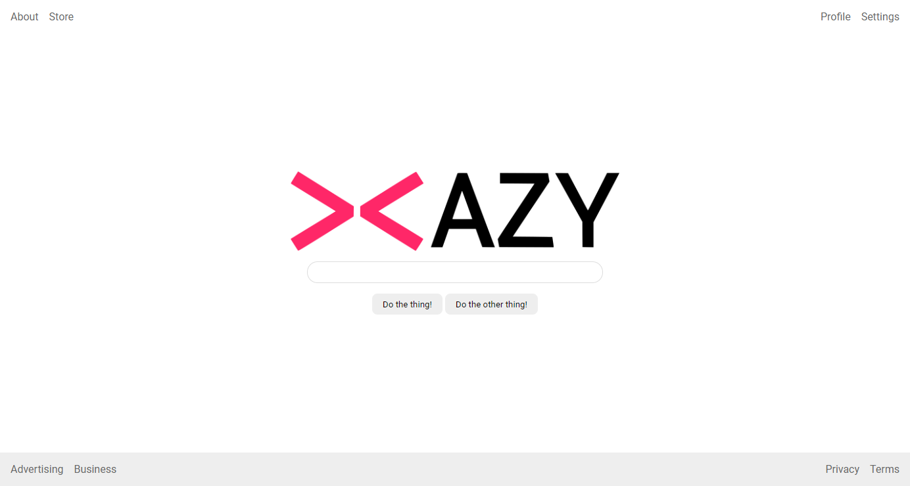

# მთლიანი გვერდი

ფლექსბოქსი არის ძალიან კარგი არა მარტო მთლიანი გვერდის განლაგებისთვის, არამედ მასში მყოფი პატარა კომპონენტებისთვის. ამ დავალებაში ჩვენ მეტ სამუშაოს გიმზადებთ, ზოგი ისეთი რაღაც, რაც ჯერ შესაძლოა არ შეგხვედრიათ. გამოიყენეთ გუგლი და სხვა საშუალებები, თუ სადმე გაიჭედეთ.

### მინიშნება

- მოგიწევთ მოძებნოთ როგორ წაუშალოთ სიას წერტილები.
- იპოვოთ როგორ გასტილოთ ლინკები და ამით შეძლებთ წაუშალოთ ქვევით ხაზი.

## დასრულებული

### გადამოწმება

- ჰედერი გვერდის ზევითაა, footer ქვევით და უნდა დარჩეს იმავე ადგილას თუ შევუცვლით ზომას.
- ჰედერს და ფუტერს აქვთ პადინგი.
- ლინკები ჰედერში და ფუტერში კიდეებზეა.
- სივრცეა ლინკებს შორის ჰედერსა და ფუტერში.
- ფუტერს აქვს ღია ნაცრისფერი ფონი (`#eeeeee`).
- ლოგო, ინპუტი და ღილაკები გაცენტრილია ეკრანში.