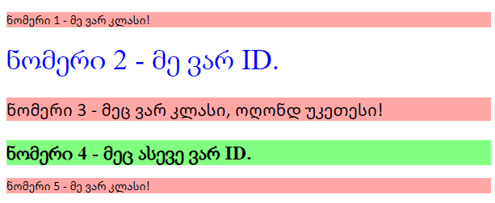

# კლასის და ID სელექტორები

იმის ცოდნა, თუ როგორ დავადოთ კლასის და ID ატრიბუტები HTML ელემენტებს, ასევე გამოვიყენოთ მათი სელექტორები, არის ძალიან მნიშვნელოვანი.

ამ დავალებაში არის რამდენიმე ელემენტი, რომლებსაც თქვენ უნდა დაადოთ კლასის ან ID-ის ატრიბუტი და უნდა მიიღოთ ის შედეგი, რაც ფოტოზეა.  დააკვირდით სურათს კარგად და სცადეთ გონებაში წარმოიდგინოთ რომელი ელემენტებია მსგავსად გასტილული, რათა ერთნაირი კლასი დაადოთ, რომელი ელემენტია უნიკალური სხვა ელემენტებთან შედარებით, რათა ID სელექტორი დაადოთ.

არ აქვს მნიშვნელობა, რომელ კლასს ან აიდი მნიშვნელობას გამოიყენებთ, რადგან აქ უნდა ფოკუსირდეთ დაამატოთ ატრიბუტები და გამოიყენოთ სწორი სელექტორი, რათა გასტილოთ ელემენტები. ამ გაკვეთილში სცადეთ გამოიყენოთ არა-სიტყვიერი ფერის მნიშვნელობები (მაგ: RGB, HEX, HSL). 

### გასტილეთ ასე:

- **ყველა კენტად დანომრილ ელემენტს**: ღია წითელი/ვარდისფერი ფონი და ფონტების სია `Calibri` და `DejaVu Sans`, რომელთაც ექნებათ `sans-serif` ფონტი დაზღვევისთვის
- **მეორე ელემენტს**: ლურჯი ტექსტი და ფონტის ზომა - 16 პიქსელი
- **მესამე ელემენტს**: იმ სტილებთან ერთად, რომელსაც ყველა კენტს დაადებთ, დამატებით ფონტის ზომა - 24 პიქსელი
- **მეოთხე ელემენტს**: ღია მწვანე ფონი, ფონტის ზომა - 24 პიქსელი და სქელი ტექსტი

# უნდა გამოვიდეს ასეთი:

### გადამოწმება:

- იზიარებენ კენტად დანომრილი `p` ელემენტები საერთო კლასს?
- აქვთ ლუწად დანომრილ `div` ელემენტებს უნიკალური ID-ები?
- აქვს მესამე ელემენტს რამდენიმე კლასი?