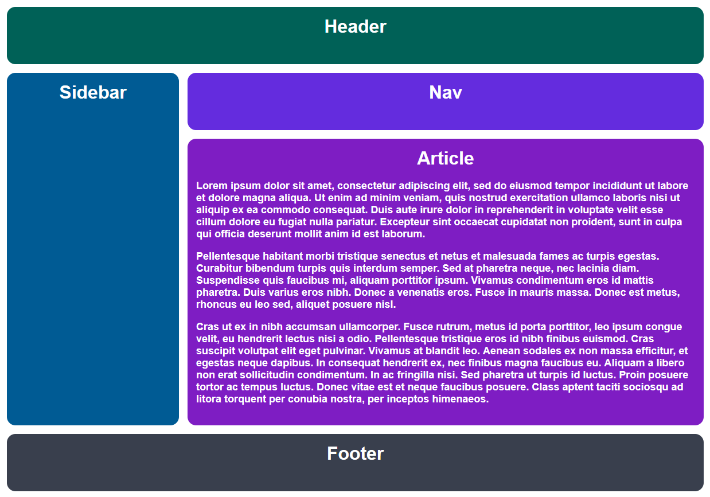

# გრიდის პირველი ლეიაუთი

ახლა დროა გამოვიყენოთ გრიდის ხელსაწყო, რომელიც ვისწავლეთ და ავაწყოთ მსგავსი ლეიაუთი. ასეთი გაკეთებული გვაქვს ფლექსბოქსითაც. თქვენ უნდა გამოიყენოთ მხოლოდ გრიდი.

### მინიშნება

- თქვენ გჭირდებათ CSS სელექტორების დამატება.
- გადახედეთ გრიდის შექმნის გაკვეთილს, თუ დაგავიწყდათ, როგორ გადააქციოთ ელემენტი გრიდად.
- გამოიყენეთ პიქსელები რიგებისა და სვეტებისთვის.

## დასრულებული

### გადამოწმება

- gap არის 15 პიქსელი
- გრიდს აქვს ორი სვეტი
- გრიდს აქვს ოთხი რიგი
- მეორე სვეტი არის სამჯერ უფრო დიდი ვიდრე პირველი
- მესამე რიგი არის ხუთჯერ დიდი სხვებთან შედარებით