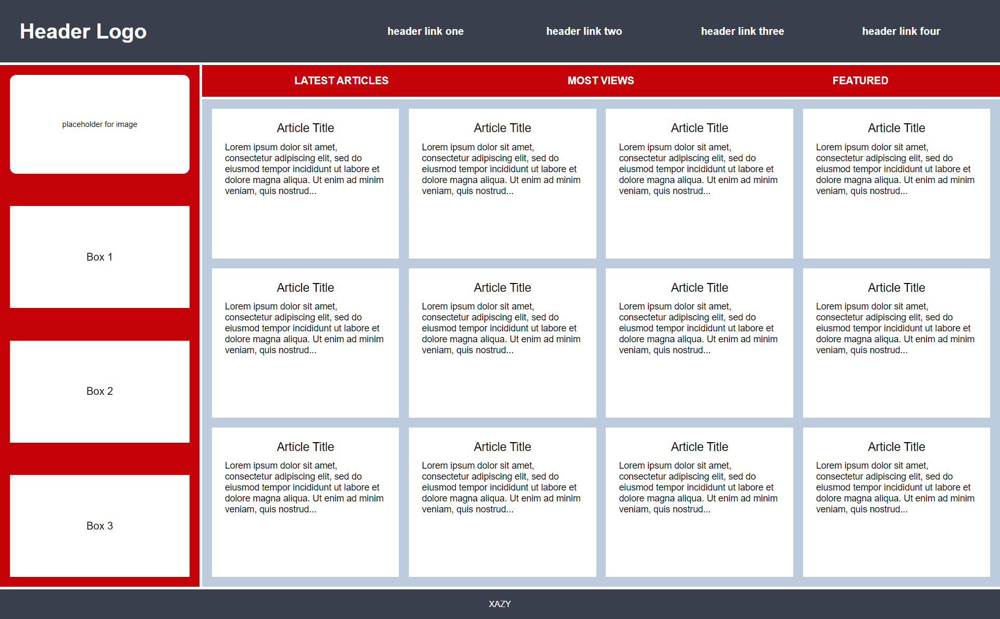
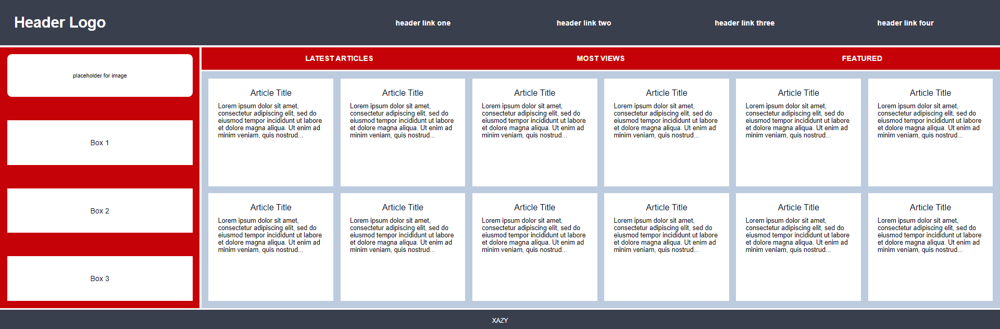

# კიდევ გრიდი

ჩვენი გრიდი რესპონსული გავხადეთ და დროა რაღაცეები დავამატოთ. ეს უფრო ძნელია ვიდრე გგონიათ. შეიძლება ფლექსბოქსის გამოყენებისკენ წაგძლიოთ, მაგრამ მხოლოდ გრიდით სცადეთ.

### მინიშნება

- ამ დავალებაში დაგჭირდებათ CSS ბლოკების დამატება style.css ფაილში. გადახდედეთ HTML-ს რომ ნახოთ რომელი სელექტორის და კომბინატორის გამოყენება შეგიძლიათ.
- თქვენ არ გჭირდებათ HTML-ში რაიმეს შეცვლა, მაგრამ გადახდეთ შვილებისა და მშობლების "ურთიერთობებს" ელემენტებში.

## დასრულებული

თუ თქვენ გამოიყენებთ ხელსაწყოებს, რომელიც რთული გრიდის გაკვეთილზე ისწავლეთ, შეძლებთ არტიკლების კარტების ისე განლაგებას, რომ ავტომატურად ჩაეტიოს ბრაუზერში, როცა ზომას შევცვლით:

### გადამოწმება
- კონტეინერს აქვს ორი სვეტი
- კონტეინერის მეორე სვეტი არის ოთხჯერ დიდი პირველთან შედარებით.
- კონტეინერის ელემენტს აქვს 4px gap.
- ჰედერის ელემენტს აქვს ორი სვეტი.
- `ul` მენიუს ელემენტის შიგნით შეიცავს კიდევ ერთ გრიდს.
- `ul` nav ელემენტის შიგნით შეიცავს კიდევ ერთ გრიდს.
- საიდბარის ელემენტს აქვს 50 პიქსელიანი gap.
- ტექსტი საიდბარში გაცენტრილია გრიდით.
- არტიკლის ელემენტს უნდა ჰქონდეს `repeat`, `auto-fit` და `maximum` სტილები.
- არტიკლის სვეტს უნდა ჰქონდეს მნიშვნელობები მინიმუმ 250 პიქსელი და მაქსიმუმ 1fr.
- არტიკლის ელემენტს აქვს 15 პიქსელიანი gap.
- კარტის ელემენტს შიგნით არტიკლებს აქვთ კონტეინერი 200 პიქსელიანი სიმაღლით.