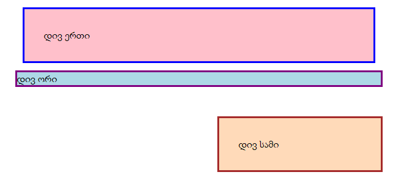

# Margin და Padding სავარჯიშო

ამ დავალებას მოყვება index.html და style.css, რომლის css ფაილში დარედაქტირება მოგიწევთ, ისე, რომ მიიღოთ სურათზე ნაჩვენები შედეგი. თქვენ მხოლოდ მოგიწევთ margin-ისა და padding-ის მნიშვნელობების შეცვლა. თქვენ არ უნდა დაამატოთ ან წაშალოთ CSS სტილები, ასევე არ უნდა შეეხოთ HTML ფაილს.

# დასრულებული

# გადამოწმება

გამოიყენეთ ეს სექცია რათა შეამოწმოთ თქვენი ნამუშევარი. ამ პროექტებში თქვენი მიზანი არაა 100%-ით სიზუსტით გქონდეთ აწყობილი, არამედ გამოიყენოთ ისინი, რაც ვისწავლეთ და მიუახლოვდეთ სასურველ შედეგს.

- `დივ ერთი` და `დივ სამი` აქვთ 32 პიქსელი დაშორება მათ ტექსტსა და ბორდერს შორის.
- `დივ ერთი` აქვს 12 პიქსელი დაშორება მასსა და სხვა ელემენტებს შორის ამ გვერდზე.
- `დივ სამი`-ს აქვს 48 პიქსელი დაშორება `დივ ერთი` და `დივ სამი`-ს შორის.
- `დივ სამი` მარჯვენა მხარესაა
- `დივ სამი`-ს პოზიცია გამოყენებულია `margin`-ის გამოყენებით.